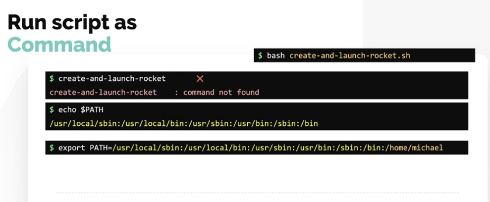

To run a shell file:  

`$ bash create-and-launch-rocket.sh`

#### Create our my own executable command on my system:

There are different ways to execute a shell script. We saw one way is using the `bash` command. You can also configure a shell script to run like any other command on your system as an executable, such as `create-and-launch-rocket.sh`. This way, you can create your own executable commands on your system by simply developing shell scripts. Now, if you plan to do this, then it is a best practice to not name your script with the `.sh` extension, because you don't typically see commands in Linux with a `.sh` extension. This way, it looks more like a command.  

However, if you try to run it now, you'll see an error that says command not found. We have only created the script, but we haven't really configured it as a command. We haven't told the operating system that we intend to run this script as a command, or where this script is located. Whenever a command is run on a Linux system, the operating system looks at the paths configured in the PATH environment variable to locate the executable or script for that command. If it can't find the command in any of these paths that are listed here, the command not found error is thrown.  

To add our script as a command, append the path to the directory containing the script to the end of the PATH variable like this.  

  

Now, a better way to do that is to specify the `$PATH` variable instead of the existing entire path. That way, you don't have to type in the entire contents of the existing path. And you can also prevent accidentally making a mistake while typing in that existing path.

  

Once this is done, you will be able to run the script without having to provide the path like any of the other built-in or external commands that we saw earlier. To see the location of a command, run the which command followed by the name of the command you'd like to see the location of in this case running the which command and specifying the create and launch rocket command.

